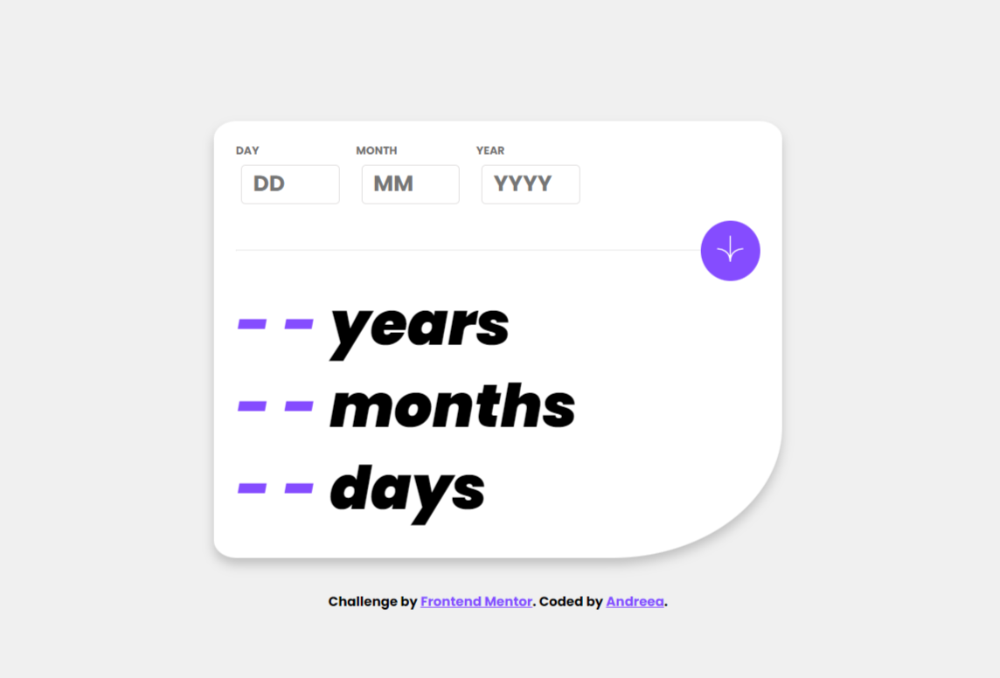

# Frontend Mentor - Age calculator app solution

This is a solution to the [Age calculator app challenge on Frontend Mentor](https://www.frontendmentor.io/challenges/age-calculator-app-dF9DFFpj-Q). Frontend Mentor challenges help you improve your coding skills by building realistic projects.

## Table of contents

- [Overview](#overview)
  - [The challenge](#the-challenge)
  - [Screenshot](#screenshot)
  - [Links](#links)
- [My process](#my-process)
  - [Built with](#built-with)
  - [What I learned](#what-i-learned)

## Overview

The objective of this project was to create a user-friendly age calculator app. The primary functionality is to request users to input their birthdate and, once submitted, it showcases their age in years, months, and days. It offers real-time feedback through visual cues and error messages, ensuring the data inputted by users is accurate.

### The challenge

Users should be able to:

- View an age in years, months, and days after submitting a valid date through the form
- Receive validation errors if:

  - Any field is empty when the form is submitted
  - The day number is not between 1-31
  - The month number is not between 1-12
  - The year is in the future

- View the optimal layout for the interface depending on their device's screen size
- See hover and focus states for all interactive elements on the page

### Screenshot

### Links

- Live Site URL: https://agecalculator-application.netlify.app/

### Built with

- HTML
- CSS
- JavaScript

### What I learned

This project served as a valuable learning experience for me across various domains. With the help of JavaScript I improved my understanding of form validation and live feedback implementation, with a specific emphasis on real-time responsiveness. Furthermore, I enhanced my ability to present clear error messages for the incorrect inputs.
